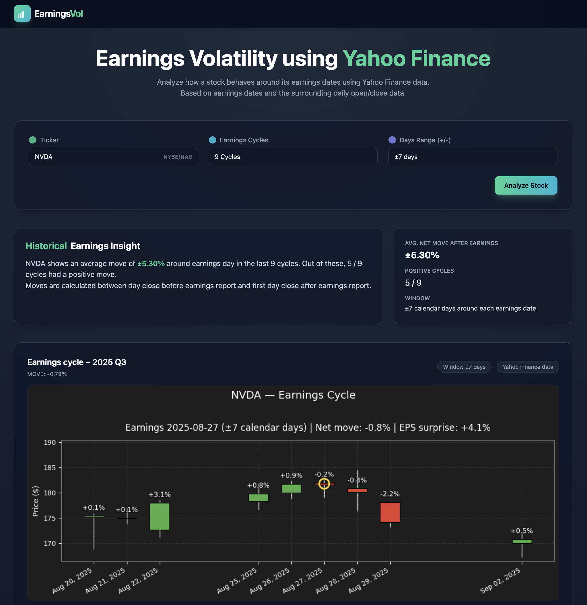

# 📊 **EarningsVol**
### _Earnings Activity Visualizer_

A lightweight web application that visualizes how a stock behaves around its most recent earnings cycles.

Data is pulled in real time using the [**yfinance**](https://github.com/ranaroussi/yfinance) API (Apache-2.0) from [**Yahoo! Finance**](https://finance.yahoo.com/).

The application runs a Python backend and is deployed on **Google Cloud Run**.

 

---

## **Features**

- 📈 **Daily Candlestick Charts** around each earnings date (± configurable window)  
- 🔍 **Per-day % change labels** displayed above each candle  
- 🟡 **Earnings event marker** placed on the trading day used for reaction calculation  
- 📑 **EPS Surprise (%)** added to each cycle’s title  
- 📉 **Net Move (%)** from pre-earnings close to post-earnings close (based on BMO/AMC timing)  
- 🌐 **Cloud Deployment**  
- 🆓 **Runs fully on free tier**

---

## **Screenshot**

  

---